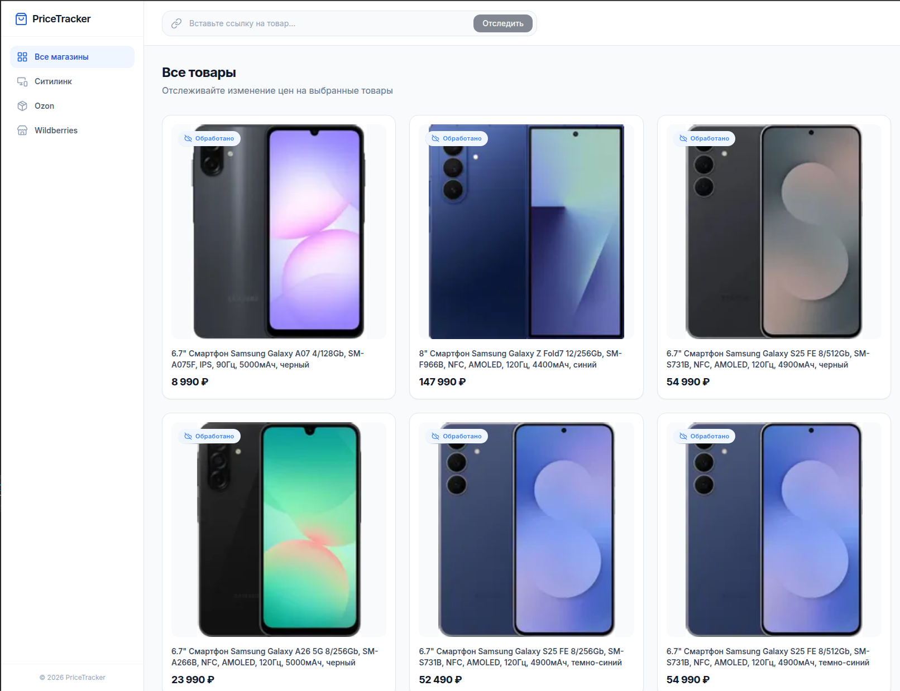

# <a href="https://github.com/Maxim-Belyi/PriceTracker"> PriceTracker: Асинхронный парсер цен на Go </a>

Микросервисный проект для фонового отслеживания цен на товары <br>
Демонстрирует паттерн асинхронного взаимодействия между сервисами на базе очередей сообщений (RabbitMQ).




## 🚀 О проекте

Приложение демонстрирует концепции языка Go и построения распределенных систем: работу с брокерами сообщений (Publisher/Consumer), ручное управление подтверждениями (Ack/Nack), написание чистых SQL-запросов через `pgx` и микросервисную архитектуру.

Состоит из трёх независимых компонентов:
1. **API Gateway:** HTTP-сервер, который принимает REST-запросы от клиентов, сохраняет начальное состояние в базу данных и публикует задачу (сообщение) в очередь RabbitMQ. Не заставляет клиента ждать парсинга. Также проксирует изображения с CDN Ситилинк, чтобы обойти hotlink-защиту.
2. **Parser Worker:** Фоновый демон без HTTP-интерфейса. Непрерывно слушает очередь RabbitMQ, забирает ссылки на товары, парсит их цены через HTML (goquery), обновляет информацию в PostgreSQL и отправляет подтверждение брокеру (ACK).
3. **Frontend SPA:** React + TypeScript интерфейс для просмотра отслеживаемых товаров, истории цен и добавления новых ссылок.

## 🛠️ Стек технологий
# Backend
<div> 
 

 
 

 
</div>

<br>

# Frontend
<div> 
 

 
 

</div>

## ⚙️ Как запустить локально

### Необходимые компоненты
* [Go](https://golang.org/dl/) (версия 1.22+)
* [Node.js](https://nodejs.org/) (версия 18+)
* [Docker и Docker Compose](https://www.docker.com/)

### 1. Клонируйте репозиторий

```sh
git clone https://github.com/Maxim-Belyi/PriceTracker.git
cd PriceTracker
```

### 2. Поднимите инфраструктуру (PostgreSQL + RabbitMQ)

С помощью скрипта `init_db/init.sql` все необходимые таблицы (`items` и `price_history`) создадутся автоматически при первом запуске.

```sh
docker compose up -d postgres rabbitmq
```

*Панель управления RabbitMQ: `http://localhost:15672` (guest/guest)*

### 3. Запустите бэкенд (два отдельных терминала)

Установите зависимости и запустите сервисы:

```sh
# Терминал 1 — Worker (фоновый парсер)
cd worker && go mod tidy
go run ./cmd/main.go

# Терминал 2 — API Gateway (порт 8080)
cd api && go mod tidy
go run ./cmd/main.go
```

### 4. Запустите фронтенд

```sh
cd frontend
npm install
npm run dev
```

Откройте в браузере: **`http://localhost:5173`**

> **Важно:** API должен быть запущен до открытия фронтенда. Фронтенд обращается к `http://localhost:9090` (или `8080` — в зависимости от конфигурации).

## 🐳 Запуск через Docker Compose (всё сразу)

Для полного запуска всех сервисов одной командой:

```sh
docker compose up -d
```

После этого:
- **API** доступен на `http://localhost:9090`
- **Frontend** собрать отдельно (`npm run build` → `npm run preview`)
- **RabbitMQ UI** на `http://localhost:15672`

## 📝 REST API

| Метод | Путь | Описание |
|-------|------|----------|
| `GET` | `/items` | Получить все отслеживаемые товары |
| `POST` | `/track` | Добавить URL каталога в очередь парсинга |
| `GET` | `/history/{id}` | История цен товара |
| `GET` | `/image-proxy?url=` | Прокси для изображений CDN |

**Пример добавления ссылки:**
```bash
curl -X POST http://localhost:9090/track \
  -H "Content-Type: application/json" \
  -d '{"url": "https://www.citilink.ru/catalog/smartfony/"}'
```

## 🌐 Архитектура

```
[Frontend SPA] ──► [API Gateway :9090]
                        │
                        ├──► [PostgreSQL] (хранение товаров и истории цен)
                        ├──► [RabbitMQ]  (очередь задач на парсинг)
                        └──► [CDN Proxy] (проксирование изображений)
                                               │
                              [Worker] ◄────────┘
                                 │
                                 └──► [citilink.ru HTML parser]
```

Логика парсинга вынесена в отдельный слой (паттерн Адаптер), что позволяет добавлять новые правила скрапинга для других магазинов, не меняя основную бизнес-логику воркера.

---

**Примечание:** Это учебный проект, в нём могут быть ошибки и упрощения.